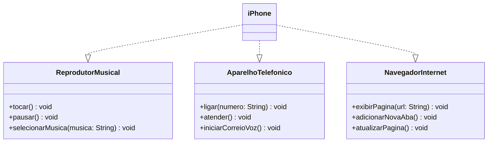

# 📱 Projeto Java: iPhone Component
Este projeto implementa o componente iPhone, que inclui três funcionalidades principais:

🎵 **Reprodutor Musical**: Tocar, pausar, e selecionar músicas.  
📞 **Aparelho Telefônico**: Fazer chamadas, atender e iniciar o correio de voz.  
🌐 **Navegador de Internet**: Exibir páginas, adicionar novas abas e atualizar a página.

## 🛠️ Funcionalidades

🎵 **Reprodutor Musical**  
`tocar()`: Inicia a reprodução de uma música.  
`pausar()`: Pausa a música atual.  
`selecionarMusica(String musica)`: Seleciona uma música para tocar.

📞 **Aparelho Telefônico**  
`ligar(String numero)`: Realiza uma chamada para o número especificado.  
`atender()`: Atende a uma chamada recebida.  
`iniciarCorreioVoz()`: Inicia o correio de voz.

🌐 **Navegador de Internet**  
`exibirPagina(String url)`: Exibe a página da URL especificada.  
`adicionarNovaAba()`: Adiciona uma nova aba no navegador.  
`atualizarPagina()`: Atualiza a página atual.


## 🧩 Estrutura do Projeto

```plaintext
/src
   ├── ReprodutorMusical.java       # Interface Reprodutor Musical
   ├── AparelhoTelefonico.java      # Interface Aparelho Telefônico
   ├── NavegadorInternet.java       # Interface Navegador de Internet
   └── iPhone.java                  # Classe que implementa todas as interfaces
````

## 🔧 Configuração do Projeto

```bash
# Clone o repositório:
git clone https://github.com/o0brunolopes0o/dio-trilha-java-basico/tree/main/desafio-poo

# Compile o projeto:
cd projeto-iphone-component
javac -d bin src/*.java

# Execute o projeto:
java -cp bin iPhone
```

## 📊 Diagrama UML
Aqui está o diagrama UML que representa a arquitetura do projeto:



## 📜 Exemplo de Uso

O exemplo abaixo demonstra como utilizar as funcionalidades do iPhone:

```java
public class Main {
    public static void main(String[] args) {
        iPhone meuIphone = new iPhone();

        // Funções de Reprodutor Musical
        meuIphone.selecionarMusica("Imagine - John Lennon");
        meuIphone.tocar();
        meuIphone.pausar();

        // Funções de Aparelho Telefônico
        meuIphone.ligar("123456789");
        meuIphone.atender();
        meuIphone.iniciarCorreioVoz();

        // Funções de Navegador de Internet
        meuIphone.exibirPagina("https://www.example.com");
        meuIphone.adicionarNovaAba();
        meuIphone.atualizarPagina();
    }
}
```

## 📚 Tecnologias Utilizadas
- **Java 8+**: Linguagem de programação principal.
- **Mermaid**: Para a criação do diagrama UML (em Markdown).

## 🚀 Próximos Passos
- Implementar novas funcionalidades ao componente, como a câmera e o gerenciamento de mensagens.
- Melhorar o design da interface e otimizar o desempenho.

## 👨‍💻 Autor
Desenvolvido por **Bruno Lopes** - [GitHub](https://github.com/o0brunolopes0o)
